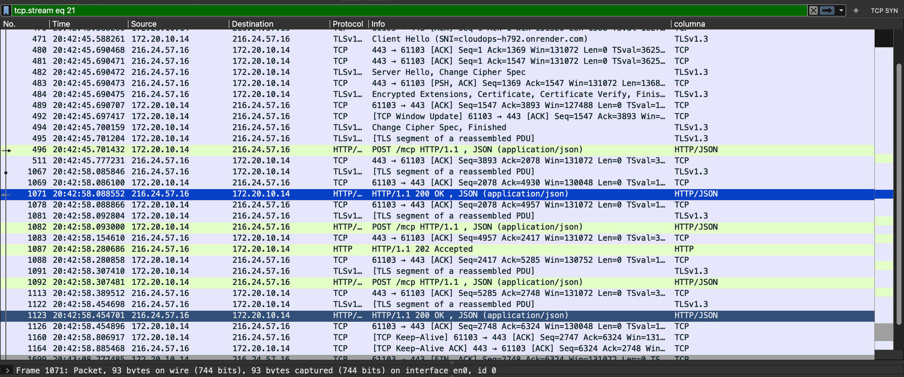
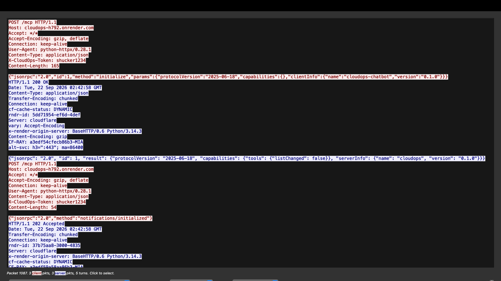

# Wireshark Analysis — Remote CloudOps Server (Parte 2)

Required deliverable per the assignment spec, §3.1 point 7 ("Análisis de la
comunicación... capturar todas las interacciones entre el anfitrión y el
servidor, indicando qué mensajes JSON-RPC corresponden a sincronización,
cuáles a solicitud/petición, y cuáles a respuestas") and report point 9
("explicar qué sucede a nivel de las capas de enlace, red, transporte y
aplicación"). Capture taken against the real deployment described in
`docs/cloudops-server-spec.md` §3.1 (`https://cloudops-h792.onrender.com`),
not a local simplification.

## 1. Methodology: decrypting HTTPS with `SSLKEYLOGFILE`

Render (like Cloud Run) only exposes HTTPS publicly, so a raw capture shows
nothing but encrypted `Application Data` records. `mcp_client/http_transport.py`
already supports the standard workaround: when the `SSLKEYLOGFILE`
environment variable is set, Python's `ssl` module writes each TLS
connection's session secrets to that file as the handshake happens
(`_build_ssl_context()` in that module). Wireshark can then use the same
file to derive the traffic keys and decrypt the capture after the fact —
this analyzes the **real** connection to the deployed server, not a
locally-simplified stand-in.

Steps used for this capture:

1. `export SSLKEYLOGFILE=~/Desktop/cloudops-sslkeys.log` in the terminal
   that would run the chatbot.
2. Start a Wireshark capture on the active interface (`en0`).
3. In the same terminal, `python -m chatbot.main`, then a CloudOps prompt
   (e.g. "what's the status of my servers?").
4. Stop the capture.
5. Wireshark → Settings → Protocols → TLS → "(Pre)-Master-Secret log
   filename" → point at `cloudops-sslkeys.log`. All `Application Data`
   records for that session are decrypted retroactively.
6. Isolate the connection to Render: display filter
   `tls.handshake.extensions_server_name contains "onrender"` to find the
   `Client Hello`, then right-click → Conversation Filter → TCP to see the
   full exchange.

## 2. Capture overview

| | |
|---|---|
| Client | `172.20.10.14`, TCP port `61103` |
| Server (SNI) | `cloudops-h792.onrender.com` |
| Server (resolved IP) | `216.24.57.16`, port `443` |
| TLS version | TLS 1.3 |
| Application protocol | HTTP/1.1 (`Content-Type: application/json`) |

The resolved IP (`216.24.57.16`) belongs to Cloudflare's edge network, not
directly to Render's origin — visible in the decrypted response headers
(`server: cloudflare`, `cf-ray`, `x-render-origin-server: BaseHTTP/0.6
Python/3.14.3`). TLS terminates at Cloudflare's anycast edge, which then
proxies the request to the actual Render container running
`servers/cloudops/http_server.py` (the `x-render-origin-server` header is
the tell — that's our own `BaseHTTPRequestHandler`, not Cloudflare's own
server software).

A second, separate TCP connection (different Cloudflare edge IP,
`216.24.57.18`) opened right as this one closed — httpx/Cloudflare didn't
keep the first connection alive across the gap while the user was typing a
prompt, so the actual tool call triggered by the chat message landed on a
new connection. The handshake below is the one captured for `initialize` /
`notifications/initialized` / `tools/list`, all of which happen automatically
at chatbot startup, before any user input.

## 3. Layer-by-layer analysis

**Link layer (Ethernet, packets 469-470 and throughout):** standard
Ethernet II framing between the Mac's network interface and its default
gateway — irrelevant to the application, but it's the layer Wireshark
captures at (`en0`), everything above is reassembled from these frames.

**Network layer (IP):** `172.20.10.14` (client, behind NAT — a private
range) → `216.24.57.16` (Cloudflare edge, public). Every frame carries this
IPv4 header; routing beyond the client's own gateway isn't visible from a
single-host capture, but the destination is a public anycast IP typically
served from whichever Cloudflare PoP is geographically nearest the client.

**Transport layer (TCP):** a standard 3-way handshake (SYN → SYN-ACK → ACK,
just before packet 469) opens the connection on port 443, followed by the
TLS 1.3 handshake carried over it. Later, `[TCP Keep-Alive]` packets (1160,
1164) keep the connection open between requests, and the connection tears
down cleanly with `FIN, ACK` in both directions (1699 → 1708 → 1709) — no
resets, no dropped packets in this exchange.

**Application layer (TLS + HTTP + JSON-RPC):** the TLS 1.3 handshake itself
(packets 471-494) negotiates the encrypted channel:

```
471  Client Hello (SNI=cloudops-h792.onrender.com)
482  Server Hello, Change Cipher Spec
484  Encrypted Extensions, Certificate, Certificate Verify, Finished
494  Change Cipher Spec, Finished                    <- handshake complete
```

Everything after packet 494 is `Application Data` — encrypted HTTP/1.1
carrying the manually-implemented JSON-RPC 2.0 protocol from
`mcp_client/`/`servers/mcp_stdio_server.py`. With the session keys loaded,
Wireshark dissects these as `HTTP/JSON` and shows the plaintext directly
(see §4).

## 4. JSON-RPC message classification

Per the assignment's requirement to label each message as synchronization,
request, or response:

| # | Packet(s) | Direction | JSON-RPC | Category |
|---|---|---|---|---|
| 1 | 496 | client → server | `{"id":1,"method":"initialize",...}` | **Request** |
| 2 | 1071 | server → client | `HTTP 200`, `{"id":1,"result":{...}}` | **Response** (to #1) |
| 3 | 1082 | client → server | `{"method":"notifications/initialized"}` (no `id`) | **Synchronization** |
| 4 | 1087 | server → client | `HTTP 202 Accepted` (empty body) | ack of #3 — no JSON-RPC response is sent for a notification, by spec |
| 5 | 1092 | client → server | `{"id":2,"method":"tools/list"}` | **Request** |
| 6 | 1123 | server → client | `HTTP 200`, `{"id":2,"result":{"tools":[...]}}` | **Response** (to #5) |

The distinguishing signal is structural, not just positional: a message
**with an `id`** is a request and always gets a matching response carrying
the same `id`; a message **without an `id`** (`notifications/initialized`)
is one-way — the client doesn't wait for a JSON-RPC-level reply, and the
server only acknowledges receipt at the HTTP level (`202`, no body). This
matches `HttpTransport.send()` vs `send_request()` in
`mcp_client/http_transport.py`: `send()` (used for notifications) discards
the response body; `send_request()` (used for requests) parses and returns
it.

**Decrypted evidence** (packet 496 → 1071 → 1082 → 1087 → 1092 → 1123, via
Wireshark's "Follow → HTTP Stream"; the `X-CloudOps-Token` header value is
redacted below — see the security note in §5):

```
POST /mcp HTTP/1.1
Host: cloudops-h792.onrender.com
User-Agent: python-httpx/0.28.1
Content-Type: application/json
X-CloudOps-Token: <redacted>
Content-Length: 165

{"jsonrpc":"2.0","id":1,"method":"initialize","params":{"protocolVersion":"2025-06-18","capabilities":{},"clientInfo":{"name":"cloudops-chatbot","version":"0.1.0"}}}

HTTP/1.1 200 OK
Content-Type: application/json
Server: cloudflare
x-render-origin-server: BaseHTTP/0.6 Python/3.14.3

{"jsonrpc": "2.0", "id": 1, "result": {"protocolVersion": "2025-06-18", "capabilities": {"tools": {"listChanged": false}}, "serverInfo": {"name": "cloudops", "version": "0.1.0"}}}

POST /mcp HTTP/1.1
Host: cloudops-h792.onrender.com
X-CloudOps-Token: <redacted>
Content-Length: 54

{"jsonrpc":"2.0","method":"notifications/initialized"}

HTTP/1.1 202 Accepted
Server: cloudflare

POST /mcp HTTP/1.1
Host: cloudops-h792.onrender.com
X-CloudOps-Token: <redacted>
Content-Length: 46

{"jsonrpc":"2.0","id":2,"method":"tools/list"}

HTTP/1.1 200 OK
Content-Type: application/json

{"jsonrpc": "2.0", "id": 2, "result": {"tools": [{"name": "list_servers", ...}, {"name": "get_server_status", ...}, {"name": "check_logs", ...}, {"name": "restart_service", ...}, {"name": "scale_instance", ...}]}}
```

(Full `tools/list` result — all 5 `inputSchema`s — matches
`docs/cloudops-server-spec.md` §4 exactly, confirming the remote deployment
serves the same tool definitions as the local server.)

**Packet list** (`tcp.stream eq 21`), TLS handshake followed by the
decrypted `HTTP/JSON` rows:



**Follow → HTTP Stream** for the same connection — the plaintext exchange
transcribed above:



> Both screenshots show the real `X-CloudOps-Token` value used during this
> capture in plaintext. That token was rotated after this capture (see §5)
> — it's shown here only as it appeared during the actual analysis.

## 5. Conclusions

- The remote transport works exactly as designed: the same `MCPClient` and
  the same JSON-RPC protocol logic run over HTTP as over stdio — the only
  difference visible in the capture is the outer HTTP framing (`POST /mcp`,
  status codes) around the identical JSON-RPC bodies.
- TLS 1.3's abbreviated handshake (no separate `Server Key Exchange`
  message, `Change Cipher Spec` sent mostly for middlebox compatibility)
  completes in under 150ms once the connection reaches Cloudflare's edge —
  most of the latency in this capture (~12s between packet 496 and 1071,
  the `initialize` round trip) comes from Render's free-tier instance
  waking up from being asleep, not from the network or protocol itself.
- Request/response pairing by `id`, and the request/notification
  distinction (`id` present vs absent), map cleanly onto the assignment's
  required categories (solicitud / respuesta / sincronización) — this was
  designed into the JSON-RPC spec itself, not something added for this
  analysis.
- **Security note:** decrypting the capture also exposes the
  `X-CloudOps-Token` shared secret in plaintext, since it's sent as a
  regular HTTP header. Acceptable for this project (§1.3 of
  `PlanParte2.md` — simulated data, not a real secret to protect), but a
  reminder of why a bearer token over TLS is the *minimum* viable auth, not
  something to reuse for anything sensitive.
